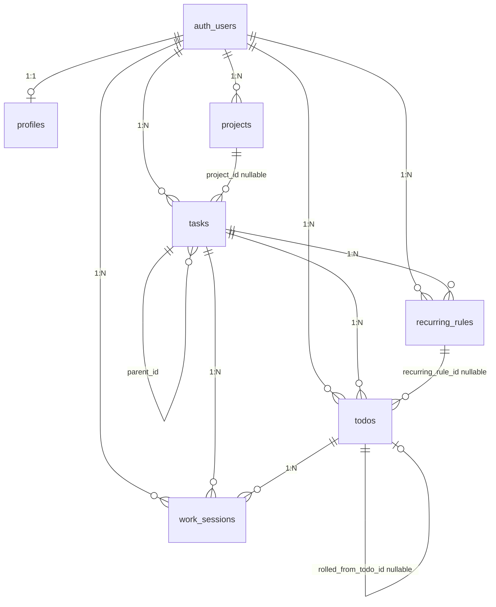

# データベーススキーマ設計

Supabase（Postgres）上のテーブル設計をまとめたドキュメントです。  
ドメイン仕様の正本は [product-spec.md](./product-spec.md) §3〜§7・§9、開発タスクは [development-roadmap.md](./development-roadmap.md) を参照してください。

**最終更新:** 2026-05-27

---

## 1. 概要

| 項目 | 内容 |
|------|------|
| **DB** | Supabase Postgres |
| **認証** | Supabase Auth（`auth.users`） |
| **隔離** | 業務テーブル全て `user_id` + **RLS**（`auth.uid() = user_id`） |
| **業務テーブル数** | 6（`profiles`, `projects`, `tasks`, `todos`, `work_sessions`, `recurring_rules`） |

### 1.1 ドメインの流れ

```
（任意）projects → tasks（リーフ/親） → todos（日付・時刻） → work_sessions（計測）
                                              ↑
                                    recurring_rules（v1）
```

| テーブル | 日本語名 | 比喩 | 要点 |
|----------|----------|------|------|
| `profiles` | プロフィール | ユーザー設定 | 始業時刻・表示名など |
| `projects` | プロジェクト | 作業の箱 | 1段のみ。Inbox・問合せはシステム行 |
| `tasks` | タスク | バックログ | 実行・計測は **リーフ** のみ |
| `todos` | Todo | その日のコミット | 計測は **todo_id 必須** |
| `work_sessions` | 作業セッション | 実績の本体 | 同時に動くセッションは **1件のみ** |
| `recurring_rules` | 定期ルール | 繰り返し定義 | 「明日を準備」で Todo 生成（v1） |

### 1.2 作成タイミング（フェーズ）

| テーブル | MVP（P0〜P2） | v1（P3） | 将来 |
|----------|:-------------:|:--------:|:----:|
| `profiles` | ○ | | Stripe カラム |
| `projects` | ○ | | |
| `tasks` | ○ | | |
| `todos` | ○ | | |
| `work_sessions` | ○ | | |
| `recurring_rules` | | ○ | 祝日スキップ等 |

MVP 最小（認証 + 今日カレンダー + 計測 + 繰越）では **`recurring_rules` 以外の5テーブル** で足りる。

---

## 2. ER 図



---

## 3. 共通規約

### 3.1 全業務テーブルに含める列

| カラム | 日本語名 | 型 | 説明 |
|--------|----------|-----|------|
| `id` | ID | `uuid` | PK。`gen_random_uuid()` |
| `user_id` | ユーザーID | `uuid` | NOT NULL。FK → `auth.users(id) ON DELETE CASCADE` |
| `created_at` | 作成日時 | `timestamptz` | NOT NULL。`now()` |
| `updated_at` | 更新日時 | `timestamptz` | NOT NULL。`now()`（更新 trigger 推奨） |

### 3.2 RLS ポリシー（方針）

各テーブルで以下を **SELECT / INSERT / UPDATE / DELETE** すべてに適用:

```sql
-- 例: projects
USING (auth.uid() = user_id)
WITH CHECK (auth.uid() = user_id)
```

- 通常 CRUD は **anon key + ユーザ JWT** と RLS
- サービスロールキーは管理・バッチ用途のみ

### 3.3 推奨インデックス（共通）

- 全テーブル: `(user_id)`
- 日次画面: `todos (user_id, date)`
- セッション: `work_sessions (user_id) WHERE ended_at IS NULL`（部分ユニーク）

---

## 4. テーブル定義

### 4.1 `profiles`（プロフィール）

認証ユーザーに紐づくアプリ設定。`auth.users` と 1:1。

| カラム | 日本語名 | 型 | NULL | 説明 |
|--------|----------|-----|:----:|------|
| `id` | ID | `uuid` | | PK。`= auth.users.id` |
| `user_id` | ユーザーID | `uuid` | | `id` と同一でよい（RLS 用に冗長保持可） |
| `email` | メールアドレス | `text` | ○ | 表示用。Auth から同期 |
| `display_name` | 表示名 | `text` | ○ | |
| `work_day_start` | 始業時刻 | `time` | | 翌日配置の起点。デフォルト `09:00`。§7.2 |
| `stripe_customer_id` | Stripe顧客ID | `text` | ○ | 将来課金用（P4） |
| `created_at` | 作成日時 | `timestamptz` | | |
| `updated_at` | 更新日時 | `timestamptz` | | |

**作成タイミング:** サインアップ時（DB trigger または Server Action）

---

### 4.2 `projects`（プロジェクト）

作業の分類箱。**サブプロジェクトなし**（1段のみ）。

| カラム | 日本語名 | 型 | NULL | 説明 |
|--------|----------|-----|:----:|------|
| `id` | ID | `uuid` | | PK |
| `user_id` | ユーザーID | `uuid` | | FK → `auth.users` |
| `title` | タイトル | `text` | | 必須 |
| `status` | ステータス | `text` | | `not_started` / `in_progress` / `done` 等 |
| `description` | 説明 | `text` | ○ | |
| `category` | カテゴリ | `text` | ○ | クライアント名・社内改善など |
| `color` | 表示色 | `text` | ○ | UI 用（HEX 等） |
| `is_system` | システムフラグ | `boolean` | | デフォルト `false`。Inbox 等は `true`（削除不可） |
| `archived_at` | アーカイブ日時 | `timestamptz` | ○ | |
| `created_at` | 作成日時 | `timestamptz` | | |
| `updated_at` | 更新日時 | `timestamptz` | | |

**システムプロジェクト（ユーザー登録時に自動作成）**

| title | 用途 |
|-------|------|
| Inbox | 未整理・デフォルト置き場 |
| 問合せ・差し込み | 問合せ・割込 |

**ビジネスルール**

- `is_system = true` の行は削除不可（アプリ側）
- タスクの `project_id` は NULL 可（プロジェクトなしタスク）

---

### 4.3 `tasks`（タスク）

バックログ。親子は **2段まで**（親 → 子リーフ）。

| カラム | 日本語名 | 型 | NULL | 説明 |
|--------|----------|-----|:----:|------|
| `id` | ID | `uuid` | | PK |
| `user_id` | ユーザーID | `uuid` | | FK → `auth.users` |
| `project_id` | プロジェクトID | `uuid` | ○ | FK → `projects.id`。**NULL 可** |
| `parent_id` | 親タスクID | `uuid` | ○ | FK → `tasks.id`。親タスク参照 |
| `title` | タイトル | `text` | | 必須 |
| `description` | 説明 | `text` | ○ | |
| `status` | ステータス | `text` | | `not_started` / `in_progress` / `done` 等 |
| `due_date` | 期限 | `date` | ○ | 必須化は未決 → [product-spec §13](./product-spec.md#13-未決実装時に詰める項目) D1 |
| `estimate_minutes` | 見積時間（分） | `integer` | ○ | |
| `actual_minutes` | 実績時間（分） | `integer` | | デフォルト `0`。セッション集計 |
| `is_leaf` | リーフフラグ | `boolean` | | 子なしなら `true`（導出 or 明示更新） |
| `created_at` | 作成日時 | `timestamptz` | | |
| `updated_at` | 更新日時 | `timestamptz` | | |

**ビジネスルール**

| 種類 | Todo 配置 | 計測 |
|------|:---------:|:----:|
| **親タスク**（子あり） | 不可 | 不可 |
| **リーフタスク**（子なし） | 可 | 可（Todo 経由） |

- 見積・期限・実績は **リーフ** に持つ。親は子の合計を表示
- 割込計測時: システムリーフ `（割込記録）` + `is_ad_hoc` Todo + `work_sessions.label`

**推奨インデックス:** `(user_id)`, `(user_id, project_id)`, `(parent_id)`

---

### 4.4 `todos`（Todo）

指定日の「やること」。ホーム画面 = その日の Todo カレンダー。

| カラム | 日本語名 | 型 | NULL | 説明 |
|--------|----------|-----|:----:|------|
| `id` | ID | `uuid` | | PK |
| `user_id` | ユーザーID | `uuid` | | FK → `auth.users` |
| `task_id` | タスクID | `uuid` | | FK → `tasks.id`。**NOT NULL** |
| `date` | 対象日 | `date` | | カレンダー表示の日付 |
| `scheduled_start` | 予定開始日時 | `timestamptz` | ○ | **NULL = 未配置 Todo** |
| `planned_minutes` | 予定時間（分） | `integer` | | ブロック長。通常 30。割込計測は 0 |
| `status` | ステータス | `text` | | `pending` / `done` / `rolled_over` 等 |
| `is_ad_hoc` | 割込計測用 | `boolean` | | デフォルト `false`。`true` は計画ブロック非表示・繰越除外 |
| `recurring_rule_id` | 定期ルールID | `uuid` | ○ | FK → `recurring_rules.id`（v1） |
| `rolled_from_todo_id` | 繰越元Todo ID | `uuid` | ○ | FK → `todos.id` |
| `created_at` | 作成日時 | `timestamptz` | | |
| `updated_at` | 更新日時 | `timestamptz` | | |

**未配置 Todo**

- `scheduled_start IS NULL` かつ `status = pending`
- **計測開始不可**（配置後のみ）
- 0件なら UI 非表示可

**繰越（明日を準備）**

1. 選択単位は **タスク**。同一 `task_id` の pending Todo が複数ある場合は **分数を合算** し翌日 1 件に複写
2. 翌日に **新規 Todo** を作成（同一 `task_id`、始業時刻から 30分仮配置）
3. 対象の今日側 Todo はすべて `status = rolled_over` で非アクティブ化（計測・DnD 不可）
4. 当日画面では `rolled_over` の計画をタイムラインに読み取り専用表示（履歴として残す）
5. `rolled_from_todo_id` は代表 Todo で追跡

**推奨インデックス:** `(user_id, date)`, `(task_id)`

---

### 4.5 `work_sessions`（作業セッション）

作業時間の実績。計測は **必ず Todo 経由**。

| カラム | 日本語名 | 型 | NULL | 説明 |
|--------|----------|-----|:----:|------|
| `id` | ID | `uuid` | | PK |
| `user_id` | ユーザーID | `uuid` | | FK → `auth.users` |
| `task_id` | タスクID | `uuid` | | FK → `tasks.id`（リーフ） |
| `todo_id` | Todo ID | `uuid` | | FK → `todos.id`。**NOT NULL** |
| `started_at` | 開始日時 | `timestamptz` | | |
| `ended_at` | 終了日時 | `timestamptz` | ○ | **NULL = 計測中** |
| `duration_minutes` | 作業時間（分） | `integer` | ○ | 停止時に算出・確定 |
| `source` | 記録種別 | `text` | ○ | `timer` / `manual` / `edited` |
| `label` | 表示ラベル | `text` | ○ | 割込計測のタイトル。UI・CSV で優先 |
| `created_at` | 作成日時 | `timestamptz` | | |
| `updated_at` | 更新日時 | `timestamptz` | | |

**制約**

```sql
-- ユーザーあたりアクティブセッションは最大1件
CREATE UNIQUE INDEX work_sessions_one_active_per_user
  ON work_sessions (user_id)
  WHERE ended_at IS NULL;
```

**ビジネスルール**

- 同時計測は **1セッションのみ**
- 手動追加は **開始・終了時刻必須**（分数のみ入力は不可）
- `tasks.actual_minutes` = 紐づくセッションの `duration_minutes` 合計

**推奨インデックス:** `(todo_id)`, `(task_id)`

---

### 4.6 `recurring_rules`（定期ルール）（v1 / P3）

定期タスクルール。「明日を準備」実行時に翌日 Todo を生成。

| カラム | 日本語名 | 型 | NULL | 説明 |
|--------|----------|-----|:----:|------|
| `id` | ID | `uuid` | | PK |
| `user_id` | ユーザーID | `uuid` | | FK → `auth.users` |
| `task_id` | タスクID | `uuid` | | FK → `tasks.id`（リーフ） |
| `recurrence` | 繰り返し種別 | `text` | | `daily` / `weekdays` / `weekly` |
| `day_of_week` | 曜日 | `smallint` | ○ | `weekly` 時のみ（0=日 … 6=土） |
| `scheduled_time` | 固定時刻 | `time` | ○ | NULL なら 30分仮配置 |
| `default_duration_minutes` | デフォルト時間（分） | `integer` | | デフォルト `30` |
| `enabled` | 有効フラグ | `boolean` | | デフォルト `true` |
| `created_at` | 作成日時 | `timestamptz` | | |
| `updated_at` | 更新日時 | `timestamptz` | | |

**繰り返し条件**

| `recurrence` | 翌日に生成する条件 |
|--------------|-------------------|
| `daily` | 常に |
| `weekdays` | 翌日が月〜金 |
| `weekly` | 翌日が `day_of_week` と一致 |

**制約**

- **1ルール × 1日 = Todo 最大1件**（重複生成防止。アプリ or 部分ユニークで担保）
- 祝日スキップは v2

---

## 5. 列挙型・ステータス（案）

実装時に Postgres `ENUM` または `text` + CHECK 制約で固定。

| テーブル | カラム | 日本語名 | 値（案） | 日本語 |
|----------|--------|----------|----------|--------|
| `projects` | `status` | ステータス | `not_started` | 未着手 |
| | | | `in_progress` | 進行中 |
| | | | `done` | 完了 |
| `tasks` | `status` | ステータス | `not_started` | 未着手 |
| | | | `in_progress` | 進行中 |
| | | | `done` | 完了 |
| `todos` | `status` | ステータス | `pending` | 未完了 |
| | | | `done` | 完了 |
| | | | `rolled_over` | 繰越済み |
| `work_sessions` | `source` | 記録種別 | `timer` | タイマー計測 |
| | | | `manual` | 手動追加 |
| | | | `edited` | 事後修正 |
| `recurring_rules` | `recurrence` | 繰り返し種別 | `daily` | 毎日 |
| | | | `weekdays` | 平日 |
| | | | `weekly` | 毎週指定曜日 |

---

## 6. サインアップ時の初期化

`auth.users` に新規行ができたタイミングで以下を実行（**DB trigger 推奨**）:

1. `profiles` 行を作成（`work_day_start = '09:00'`）
2. `projects` にシステム行を2件作成
   - Inbox（`is_system = true`）
   - 問合せ・差し込み（`is_system = true`）

---

## 7. 主要クエリの想定

| 画面・機能 | クエリ概要 |
|------------|------------|
| 今日カレンダー | `todos WHERE user_id = ? AND date = ?` |
| 未配置 Todo | 上記 + `scheduled_start IS NULL AND status = 'pending'` |
| 計測中セッション | `work_sessions WHERE user_id = ? AND ended_at IS NULL` |
| バックログ | `tasks WHERE user_id = ?`（リーフ + 親、プロジェクト別） |
| 明日を準備 | トランザクション: 新規 `todos` 一括 INSERT + 旧 Todo UPDATE |

複数行更新（明日を準備）は **Server Action** または **Postgres 関数（RPC）** でトランザクション化を推奨（[product-spec §11.2](./product-spec.md#112-アーキテクチャ概略)）。

---

## 8. マイグレーション順序

```
1. profiles
2. projects
3. tasks
4. todos
5. work_sessions
6. recurring_rules（v1）
7. RLS ポリシー（各テーブル）
8. サインアップ trigger / function
9. updated_at trigger（共通）
```

Supabase CLI: `supabase/migrations/` に SQL を配置。

---

## 9. 参照

| ドキュメント | 内容 |
|--------------|------|
| [product-spec.md §9](./product-spec.md#9-データモデル概念) | 概念モデル（本ドキュメントの元） |
| [product-spec.md §3〜§7](./product-spec.md) | 各エンティティのビジネスルール |
| [development-roadmap.md](./development-roadmap.md) | P0-05〜P0-09, P3-01 の実装タスク |
| [requirements.md](./requirements.md) | プロジェクト概要 |

---

## 10. 変更履歴

| 日付 | 内容 |
|------|------|
| 2026-05-27 | 初版作成（product-spec §9 を詳細化） |
| 2026-05-27 | 各テーブル・カラムに日本語名を追加 |
